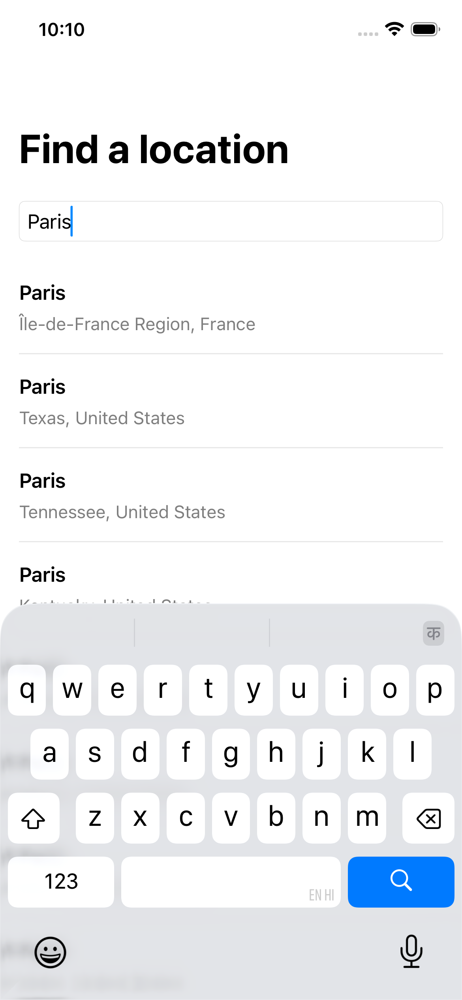
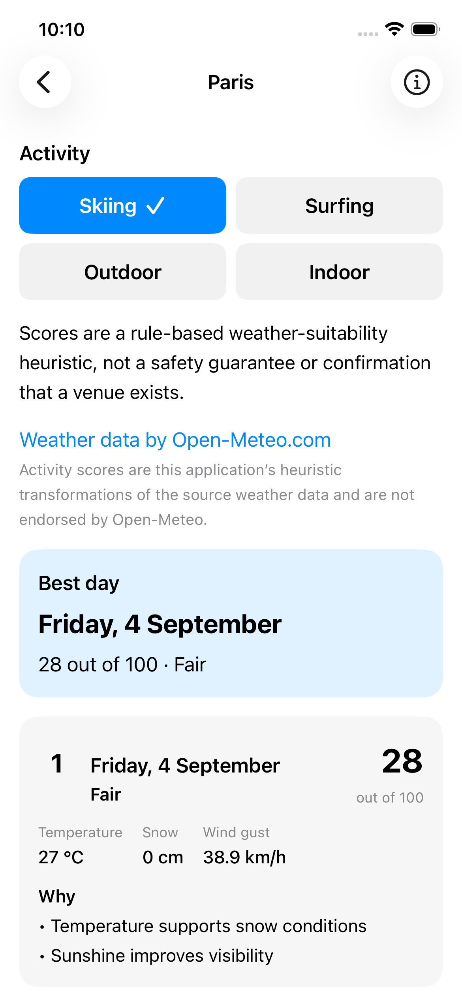
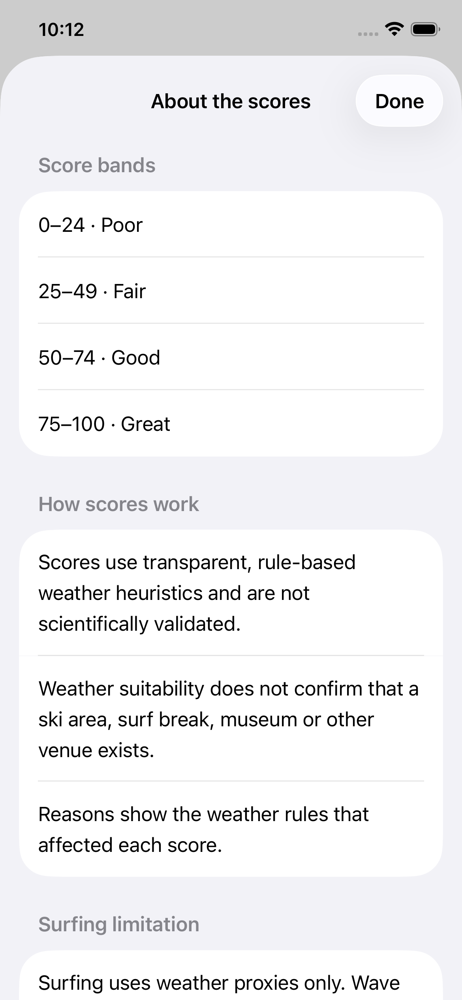

# Activity Weather

Activity Weather is a public, native SwiftUI sample that turns a seven-day
Open-Meteo forecast into ranked, explainable weather suitability for skiing,
surfing, outdoor sightseeing, and indoor sightseeing.

It is an engineering exercise, not a safety, travel, venue, or professional
forecasting product.







## Features

- Debounced, cancellable location search with explicit selection for ambiguous
  place names
- One forecast request per selected location and four locally derived activity
  rankings
- Seven positional ranks with local dates, numeric scores, named levels,
  relevant weather facts, and concise reasons
- Explainable rule-based scoring and visible surfing/model limitations
- Typed offline, service, invalid-data, and unknown failure handling with retry
- Dynamic Type, VoiceOver-oriented labels and summaries, adaptive controls,
  textual status communication, and light/dark appearance support
- Visible Open-Meteo and GeoNames attribution

## Requirements

- Xcode 26.2 was used for final verification; a compatible Xcode with the
  iOS 17 SDK or newer should work
- iOS 17.0+
- Swift 6 language mode
- An available iPhone or iPad Simulator
- Internet access for the running app; no API key or secret is required

The project, targets, shared scheme, and Swift module are named
`ActivityWeather`. The on-device display name is **Activity Weather**.

## Run in Xcode

1. Clone the repository.
2. Open `ActivityWeather.xcodeproj`.
3. Select the shared `ActivityWeather` scheme.
4. Choose any available iOS Simulator.
5. Run with **Product → Run**.
6. Search for a city, explicitly select a result, and explore each activity.

No signing team is required for Simulator use. Device installation may require
selecting your own development team in Xcode.

## Build and test from the command line

The following discovers the first available iPhone or iPad Simulator rather
than assuming a model or UUID:

```sh
SIMULATOR_ID="$(
  xcrun simctl list devices available |
  awk -F '[()]' '/iPhone|iPad/ && /Booted|Shutdown/ { print $2; exit }'
)"
test -n "$SIMULATOR_ID"

set -o pipefail
xcodebuild -project ActivityWeather.xcodeproj \
  -scheme ActivityWeather \
  -destination "platform=iOS Simulator,id=$SIMULATOR_ID" \
  -derivedDataPath .derivedData \
  clean build

set -o pipefail
xcodebuild -project ActivityWeather.xcodeproj \
  -scheme ActivityWeather \
  -destination "platform=iOS Simulator,id=$SIMULATOR_ID" \
  -derivedDataPath .derivedData \
  test
```

`.derivedData/` is ignored. Automated tests use injected fakes and bundled test
fixtures; they do not call the live APIs.

## User and request flow

1. `LocationSearchViewModel` debounces input and calls
   `SearchLocationsUseCase`.
2. `OpenMeteoLocationRepository` requests and maps geocoding data.
3. The user explicitly selects a Domain `Location`.
4. `ActivityForecastViewModel` calls `GetActivityForecastUseCase` once.
5. `OpenMeteoForecastRepository` maps a seven-day metric forecast in the
   forecast response timezone.
6. The Domain scoring engine evaluates all seven days for all four activities.
7. Presentation selects an existing Domain ranking and joins weather by
   `CivilDate`; switching activities does not refetch or rescore.

## Architecture

The app uses lightweight Clean Architecture and MVVM-style presentation:

```text
SwiftUI Views → @Observable ViewModels → Domain use cases/protocols
                                            ↑
                        Data repositories and URLSession implementations
```

- **Domain:** validated models, repository protocols, use cases, and the pure
  scoring engine
- **Data:** endpoints, DTOs, transport, mappers, repository implementations,
  and infrastructure-to-Domain failure translation
- **Features:** SwiftUI views, observable state, copy, formatting, and
  accessibility presentation
- **App:** the single composition root with initializer injection

Domain does not depend on Data. DTOs remain in Data; networking does not enter
Views or ViewModels; scoring rules do not enter Presentation.

## Scoring

Scores are deterministic application heuristics on a bounded `0...100` scale:
Poor (`0...24`), Fair (`25...49`), Good (`50...74`), and Great (`75...100`).
Rules include named contributions, safety vetoes/caps, clamping, reason
ordering, and stable date tie-breaking.

The complete executable contract and worked examples are in
[docs/SCORING.md](docs/SCORING.md).

These scores are not scientifically validated. A high score does not prove
that a suitable venue exists. Surfing uses weather proxies only: wave height,
swell, tides, coastal suitability, and water temperature are not included.

## Error handling and accessibility

Data repositories translate connectivity, temporary service, malformed-data,
and unknown failures into Domain categories. Presentation supplies recovery
copy and retry without exposing HTTP codes, DTO errors, or raw descriptions.
Cancellation and stale completions do not become visible failures.

The app supports Dynamic Type including accessibility sizes, adaptive activity
controls, minimum touch targets, text in addition to colour, selected traits,
VoiceOver labels/hints, combined forecast-card summaries, stable accessibility
identifiers, long-text wrapping, and light/dark system colours. A physical
device VoiceOver pass remains advisable because Simulator inspection cannot
fully validate spoken output.

## Testing and TDD

The final suite contains unit coverage for models, mapping, networking,
repositories, use cases, scoring, formatting, cancellation/state machines, and
failure translation, plus a deterministic launch/minimum-query UI smoke test.

Strict Red → Green → Refactor was used where an actual focused failing result
was captured, including scoring, repository orchestration, ViewModel state, the
timezone correction, failure translation, and the debounce regression.
Milestone 6 was comprehensively test-backed but is not represented as strictly
test-first. SwiftUI layout was verified through the UI smoke test and manual
device, appearance, and accessibility-size inspection rather than falsely
describing visual work as unit-test-driven.

The current staged submission snapshot is clean-built and fully tested. Commit
history was reviewed for scope and readability, but historical commits were
not individually rebuilt.

## Assumptions and limitations

- The app requires live network access and has no offline cache.
- Forecasts cover the selected location's current local day plus six days.
- Geocoding does not prove the presence of a resort, beach, museum, or POI.
- Forecast payloads fail closed when required fields, units, dates, or array
  alignment are invalid.
- Weather suitability is not a safety guarantee.
- Surfing is not a marine forecast.
- No accounts, persistence, favourites, device location, maps, analytics,
  notifications, background refresh, or backend are included.

## Data attribution and licensing

- Weather and geocoding data are provided by
  [Open-Meteo](https://open-meteo.com/), whose API data is licensed under
  [CC BY 4.0](https://open-meteo.com/en/license).
- Location data are based on [GeoNames](https://www.geonames.org/).
- Activity scores are original heuristic transformations made by this
  application from source weather data.
- Open-Meteo and GeoNames do not endorse this scoring model.

Attribution is also visible in the app near location results and forecast data,
not only in this README.

## AI usage

AI assisted with planning, implementation suggestions, test generation,
documentation, and review. Suggestions were inspected, tested, corrected when
necessary, and recorded in [docs/AI_USAGE.md](docs/AI_USAGE.md). Notable
corrections include architecture placement of failure translation, accurate
timezone terminology, and avoiding unsupported TDD claims.

## Future improvements

- Add optional forecast caching with explicit freshness and offline semantics
- Integrate marine data before treating surfing as more than a proxy
- Add POI/venue validation without conflating it with weather suitability
- Localize copy and validate long translations on physical devices
- Add dependency-controlled end-to-end UI composition if the product grows
- Perform physical-device VoiceOver and real-device network-condition testing

## Documentation

- [Approach and milestone history](docs/APPROACH.md)
- [Product assumptions](docs/ASSUMPTIONS.md)
- [Scoring specification](docs/SCORING.md)
- [Architecture decisions](docs/DECISIONS.md)
- [Development and verification log](docs/DEVELOPMENT_LOG.md)
- [AI usage disclosure](docs/AI_USAGE.md)
- [Interview walkthrough](docs/INTERVIEW_WALKTHROUGH.md)
